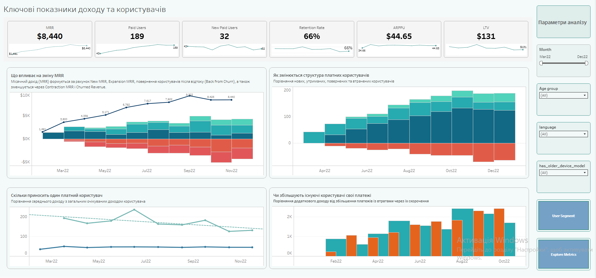
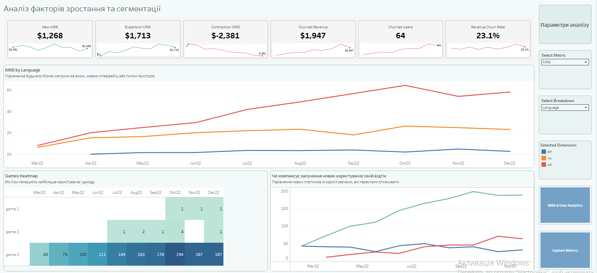
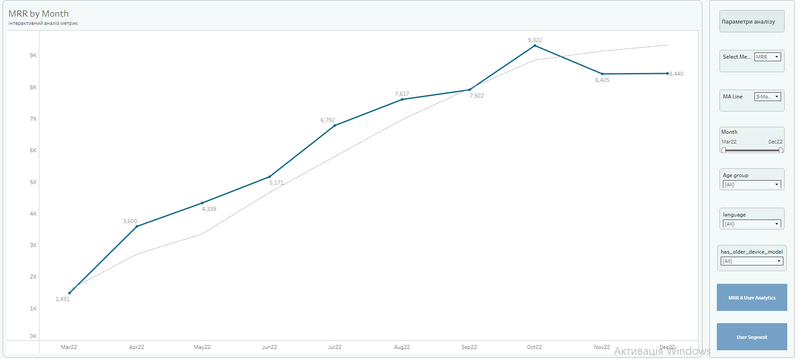

# 📊 MRR & User Analytics Dashboard

SQL + Tableau project for analyzing subscription revenue, user retention, churn, and business growth.

---

## 🔗 Live Dashboard

View the interactive dashboard on Tableau Public:

https://public.tableau.com/views/RevenueMetricsv2/Dashboard?:language=en-US&:sid=&:redirect=auth&:display_count=n&:origin=viz_share_link

---

## 📌 Project Overview

This project analyzes subscription revenue using SQL and Tableau.

The goal was to build an interactive dashboard that helps Product Managers monitor business performance, identify growth drivers, detect churn risks, and analyze user behavior.

---

## 🎯 Business Questions

- How does Monthly Recurring Revenue (MRR) change over time?
- What drives revenue growth?
- How many new users become paying customers?
- How many users churn every month?
- Do existing users increase or decrease their payments?
- Which user segments generate the highest revenue?
- Which games contribute most to revenue?

---

## 🛠 Technologies

- PostgreSQL
- SQL
- Tableau Public

---

## 📈 Metrics

- Monthly Recurring Revenue (MRR)
- New MRR
- Expansion MRR
- Contraction MRR
- Churned Revenue
- Paid Users
- New Paid Users
- Churned Users
- Retention Rate
- Revenue Churn Rate
- ARPPU
- LTV

---

## 📊 Dashboard Pages

### Dashboard 1 — Revenue & User Analytics



Provides an overview of the most important business metrics, revenue dynamics, user growth, and retention.

---

### Dashboard 2 — Growth & Segmentation Analysis



Shows revenue drivers, user segmentation, game performance, and interactive metric analysis.

---

### Dashboard 3 — Metrics Table



Displays all calculated business metrics in a tabular format for validation and detailed analysis.

---

## 📂 Repository Structure

```
sql/
    revenue_metrics_analysis.sql

presentation/
    MRR_User_Analytics_Presentation.pdf

images/
    dashboard_1.png
    dashboard_2.png
    dashboard_3.png
    preview.png
```

---

## 📄 SQL

The SQL script performs:

- data quality checks;
- duplicate removal;
- monthly revenue aggregation;
- user status classification;
- expansion and contraction MRR calculation;
- churn detection;
- preparation of the analytical dataset for Tableau.

---

## 📑 Presentation

The project presentation describing the business task, implementation process, dashboard functionality, and key findings is available in the `presentation` folder.

---

## 👩‍💻 Author

Maryna Deryahina

Junior Data Analyst
